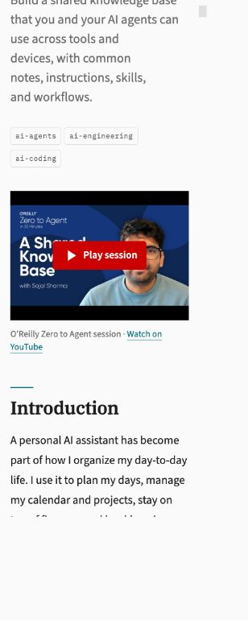
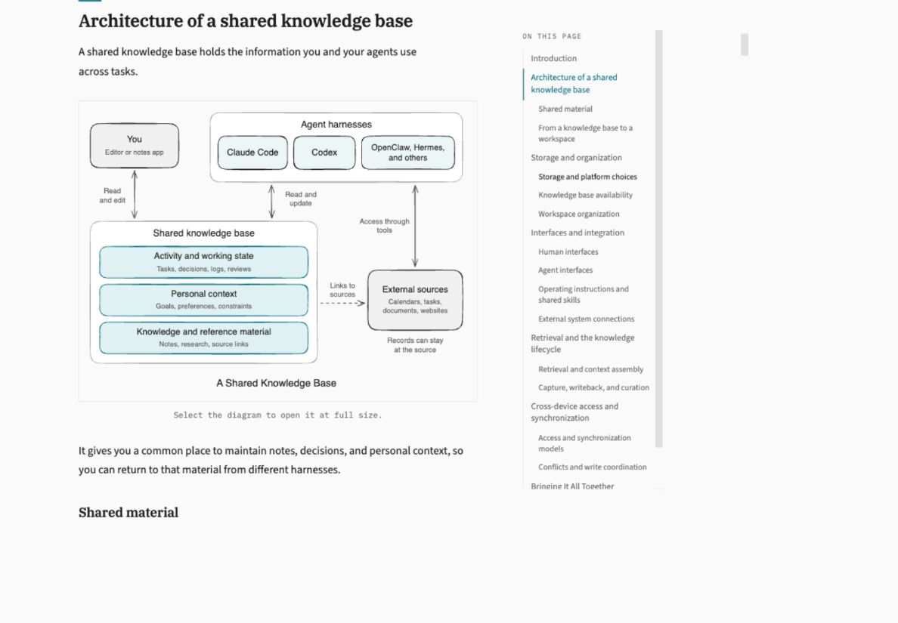
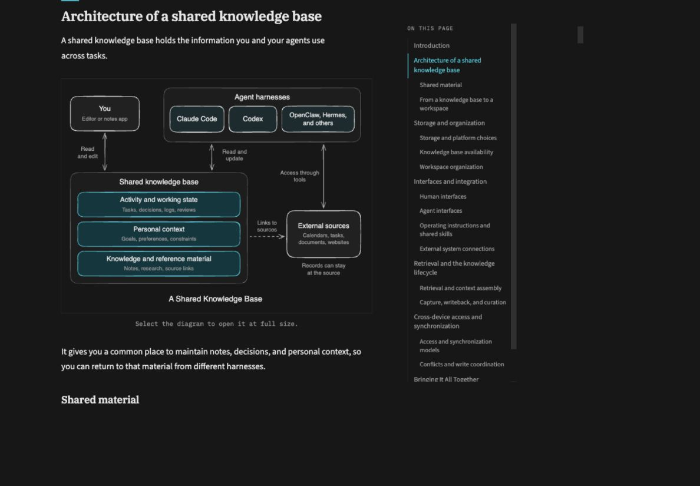
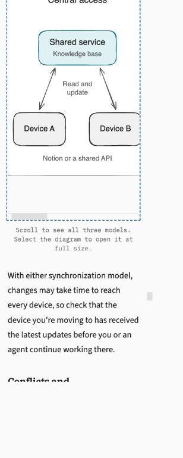
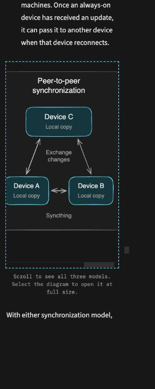

# Shared knowledge base article review

Production preview verified on September 21, 2026. Intended URL:
https://sajalsharma.com/posts/shared-knowledge-base-for-ai-agents/

## Validation

- `npm run build`: passed, including Astro diagnostics, KaTeX verification,
  static generation, and Jampack. Existing Astro/Vite deprecation hints remain.
- `npm run related:generate` and explicit `npm run related:check`: passed.
  Used the existing local credential with approval; no credentials added to Git.
- Prettier on changed source files and ESLint on the changed TypeScript files
  with the repository's TypeScript parser: passed. `git diff --check`: passed.
- Source comparison using Markdown rendering: prose, structure, examples, links,
  and diagram positions match the finished source after adapting the title,
  table of contents, and image paths. All 18 existing posts are unchanged.
- Generated HTML: one article title, one TOC heading, all anchors and local
  links resolve; canonical URL, author, publication timestamp, and generated OG
  image are correct. Article is the homepage lead and appears in the archive
  and all three tag listings. No local filesystem URLs remain.
- All ten SVGs load with the manifest's alt text and dimensions. The page
  exposes exactly five article images to accessibility tools in either theme.
  CSS hides the inactive link and image together. RSS and the full-text export
  retain five ordinary light PNG images with absolute site URLs.
- Browser review at desktop and 320 CSS pixels: all five diagrams in both
  themes; manual switching; saved light and dark choices after reload;
  system light preference after clearing the saved choice; navigation through
  home, archive, tags, and back to the article. No browser console errors.
- Mobile TOC opens and anchors work. The synchronization diagram has a labelled,
  keyboard-focusable scroll region; horizontal scrolling reaches all models
  without page overflow. Full-size SVG links work by keyboard.
- The O’Reilly session thumbnail sits above the introduction. The player loads
  only after activation; mouse click, Enter, and Space all replace the poster
  with a titled YouTube privacy-enhanced iframe and move focus into it.
  Actual playback was verified on desktop and 320px mobile, in both themes,
  with no page overflow or console errors. Navigation back to the article
  restores a working poster. The thumbnail is 1280 × 720 and loads successfully.
- The optional YouTube frontmatter leaves the Markdown body unchanged. The
  poster remains a normal YouTube link without JavaScript, and the separate
  “Watch on YouTube” link remains available after playback starts. Existing
  session links remain in RSS and text exports. Explicit `related:check` still
  passes without regenerating embeddings.

## Existing repository check failures

`npm run lint` reports three pre-existing `no-undef` errors for `dataLayer` and
`gtag` in `src/layouts/Layout.astro` (lines 168, 170, 171 on the base branch).

`npm run format:check` encounters the existing `Layout.astro` parser error and
formatting warnings in `.github/scripts/send-newsletter.mjs`, `.github/workflows/deploy.yml`,
`.github/workflows/send-newsletter.yml`, `public/katex/katex.min.css`, `README.md`,
`src/assets/logo.tsx`, and `src/components/Newsletter.astro`. These files are
unchanged. Only changed source files were formatted.

## Screenshots

Video preview on desktop (1200 × 1000 CSS viewport):

| Light                                                       | Dark                                                      |
| ----------------------------------------------------------- | --------------------------------------------------------- |
|  |  |

Video preview on narrow mobile (320 × 800 CSS viewport):

| Light                                                             | Dark                                                            |
| ----------------------------------------------------------------- | --------------------------------------------------------------- |
|  |  |

Desktop diagram evidence (1200 × 833 CSS viewport):

| Light                                               | Dark                                              |
| --------------------------------------------------- | ------------------------------------------------- |
|  |  |

Narrow mobile header (320 × 800 CSS viewport):

| Light                                             | Dark                                            |
| ------------------------------------------------- | ----------------------------------------------- |
|  |  |

Mobile synchronization diagram, scrolled within its own region:

| Light                                                                      | Dark                                                                     |
| -------------------------------------------------------------------------- | ------------------------------------------------------------------------ |
|  |  |
